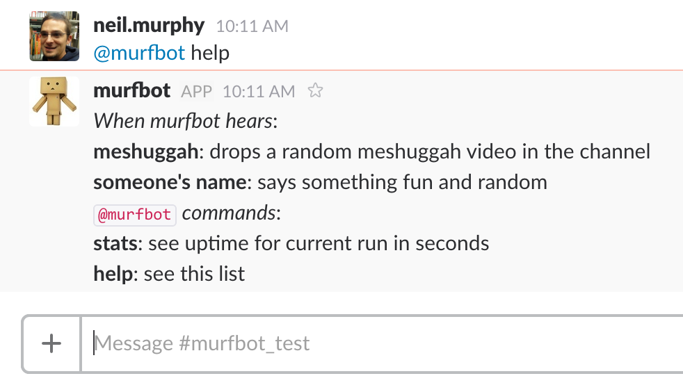

# Murfbot

Murfbot is a Slackbot I wrote for the Slack channel I share with my friends. It does fun and stupid things.

## Installation

1. Have Node.js installed.

2. Clone this repo.

```
git clone https://github.com/wnmurphy/murfbot.git
```

3. Install dependencies with npm.

```
cd murfbot
```

```
npm install
```

3. Get a Slack API key.

4. Open murfbot.js and replace "REPLACE_STRING_WITH_YOUR_SLACK_API_TOKEN" with your Slack API key.

## Running Murfbot

You'll need to leave Murfbot running in the background. When the process terminates, Murfbot will go offline.

Open a new Terminal tab, and run

```
node murfbot.js 
```

You can also make murfbot.js an executable, since the file contains

```
#! /usr/local/bin/node
```

To do this, add executable permissions to murfbot.js with

```
chmod +x murfbot.js
```

Then run with

```
./murfbot.js
```

Your Slack API key tells Murfbot which team to join. As long as Murfbot is running, you should see him as an active user on your Slack team.

## Murfbot Commands



Murfbot currently responds with inside jokes to names of friends, drops a random Meshuggah music video on mentions of 'meshuggah', chastises you if you're a potty mouth, tells you about his uptime on 'stats' direct mentions, and lists these commands on 'help' direct mentions.
